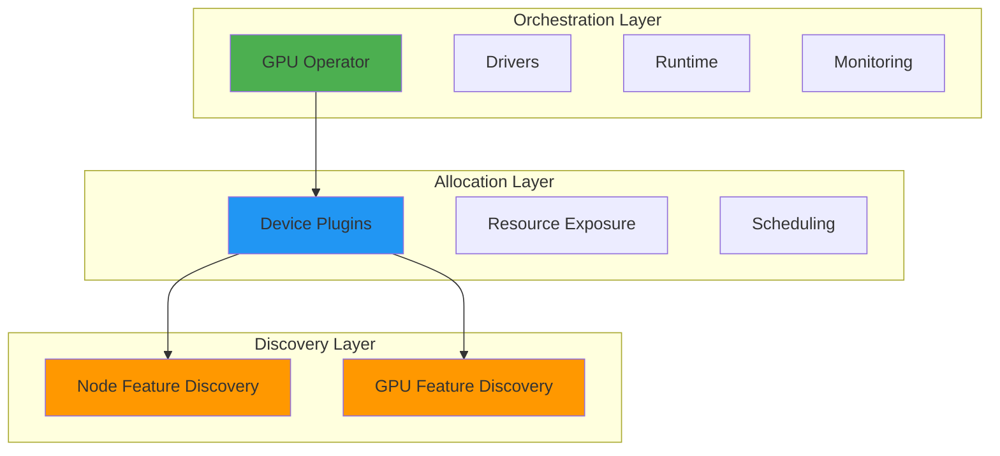
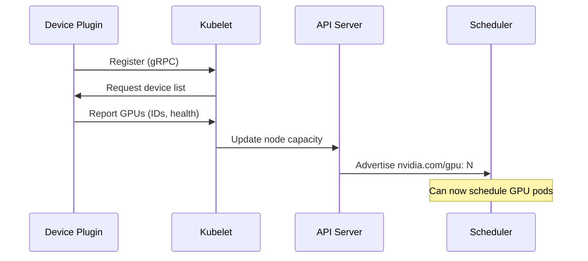
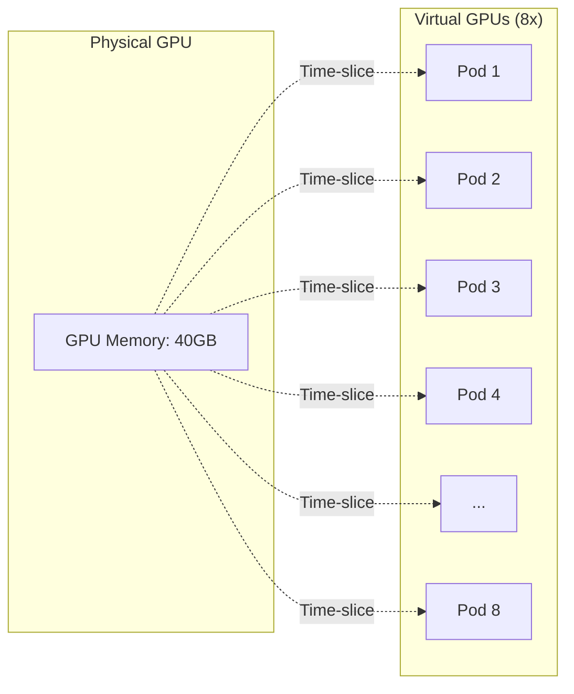
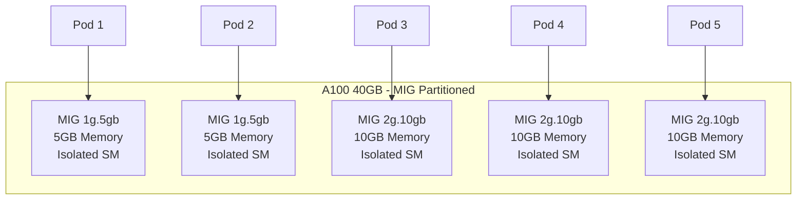

# GPUs on Kubernetes Unlocked - Presentation Outline

**Duration**: 40 minutes | **Slides**: ~26 | **Timing**: 90s/slide average

---

## Introduction (3 slides, 4 minutes)

### 1. Title Slide (60s)
**GPUs on Kubernetes Unlocked**
- Speaker intro
- Conference context
- Quick agenda preview

### 2. The Gap - Why This Matters (90s)
**Problem Statement**: Kubernetes speaks CPU and memory out-of-the-box, but LLM workloads live or die by GPUs

**The Challenge**:
- K8s native resources: CPU, memory (first-class)
- LLM workloads: GPU-dependent
- Gap: Control plane is blind to accelerators
- Impact: Scheduler can't place Pods intelligently

**Visual**: Simple comparison diagram (native vs extended resources)

### 3. The Solution - Three Layers (90s)
**How We Fix the Gap**

**Mermaid Diagram**: Three Layers Architecture


**The Journey**:
1. Discovery: Give Kubernetes a vocabulary
2. Allocation: Make GPUs schedulable
3. Orchestration: Stay declarative
4. Patterns: Match layout to workload

---

## Part 1: Discovery Layer - Giving Kubernetes a Vocabulary (3 slides, 5 minutes)

### 4. The Visibility Problem (90s)
**Challenge**: Until control-plane knows what accelerators exist, scheduler is blind

**Why Labels Matter**:
- Heterogeneous clusters: Different GPU models, memory sizes
- Scheduler needs: Architecture, memory, capabilities
- Solution: Automatic hardware detection → Node labels

### 5. Node Feature Discovery (NFD) (2 minutes)
**General-Purpose Hardware Detection**

**What It Does**:
- DaemonSet on every node
- Detects: CPU, PCI devices, network interfaces
- Outputs labels: `feature.node.kubernetes.io/pci-0302_10de.present: "true"`

**Installation**:
```bash
kubectl apply -k \
  https://github.com/kubernetes-sigs/node-feature-discovery/deployment/overlays/default
```

**Limitation**: Hardware presence, not GPU-specific details

### 6. GPU Feature Discovery (GFD) (2 minutes)
**GPU-Specific Labels - Attaching Architecture, Memory, Sharing Mode**

**Part of**: NVIDIA GPU Operator

**Key Labels**:
- `nvidia.com/gpu.product: A100-SXM4-40GB`
- `nvidia.com/gpu.memory: 40537` (MiB)
- `nvidia.com/gpu.family: ampere`
- `nvidia.com/cuda.driver-version.full: 525.105.17`
- `nvidia.com/mig.capable: true`
- `nvidia.com/gpu.replicas: 8` (time-slicing)

**Result**: Scheduler now has vocabulary for intelligent placement

---

## Part 2: Allocation Layer - Making GPUs Schedulable (5 slides, 8 minutes)

### 7. Device Plugin Framework (2 minutes)
**Turning Each Accelerator—or Fraction of One—into a Schedulable Resource**

**Four Core Functions**:
1. **Device Discovery**: Detect GPUs, report to Kubelet
2. **Resource Allocation**: Exclusive access by default
3. **Health Monitoring**: Report unhealthy devices
4. **Scheduler Integration**: Expose as extended resource (`nvidia.com/gpu`)

**Mermaid Diagram**: Device plugin registration flow


### 8. Resource-Based Scheduling (90s)
**The Simplest Approach**

**Pod Spec**:
```yaml
resources:
  limits:
    nvidia.com/gpu: 1
```

**How It Works**:
- Request GPUs like CPU/memory
- Scheduler finds node with free GPU
- Kubelet allocates exclusive access

**Pros**: Simple, no labels needed, integrated with resource model
**Cons**: GPU-blind (all GPUs look identical to scheduler)

### 9. Label-Based Scheduling (2 minutes)
**Precision Placement for Heterogeneous Fleets**

**Three Mechanisms**:

**nodeSelector** (simplest):
```yaml
nodeSelector:
  nvidia.com/gpu.product: Tesla-T4
```

**Node Affinity** (flexible):
```yaml
affinity:
  nodeAffinity:
    requiredDuringSchedulingIgnoredDuringExecution:
      nodeSelectorTerms:
      - matchExpressions:
        - key: nvidia.com/gpu.memory
          operator: Gt
          values: ["40000"]
```

**Taints/Tolerations** (protective):
```bash
kubectl taint nodes -l nvidia.com/gpu.count \
  nvidia.com/gpu=true:NoSchedule
```

### 10. Combined Approach - Best Practice (90s)
**Resource Request + Label Selection**

**Pattern**:
```yaml
resources:
  limits:
    nvidia.com/gpu: 1
nodeSelector:
  nvidia.com/gpu.family: ampere
```

**Decision Framework**:
- Homogeneous fleet → Resource-based only
- Heterogeneous fleet → Resource + Labels
- Dedicated GPU nodes → Add taints

### 11. Dynamic Resource Allocation (DRA) (90s)
**Leaving the Exact Match to the Scheduler**

**Higher Abstraction** (Beta in K8s 1.33):
```yaml
apiVersion: resource.k8s.io/v1beta1
kind: ResourceClaimTemplate
metadata:
  name: high-memory-gpu
spec:
  spec:
    devices:
      requests:
        - deviceClassName: gpu.nvidia.com/a100
          count: 1
          parameters:
            minMemory: "40Gi"
            migMode: "disabled"
```

**Benefit**: Request "high-memory GPU" by intent, not hardcoded model
**Status**: Experimental, limited production use (disabled by default)
**Future**: Moving toward production readiness

---

## Part 3: Orchestration Layer - Staying Declarative (3 slides, 5 minutes)

### 12. The Operational Challenge (90s)
**What's Needed Beyond Scheduling**

**Requirements**:
- Driver installation (kernel modules, CUDA)
- Container runtime configuration (GPU device injection)
- Health monitoring (ECC errors, temperature)
- Metrics collection (utilization, memory)
- Keeping everything aligned across cluster

**Problem**: Manual setup is error-prone, not declarative, scales poorly

### 13. NVIDIA GPU Operator (2 minutes)
**Keeping Drivers, Runtimes, and Metrics Aligned**

**Unified Management Layer**:

**Components Managed**:
- **Driver Containers**: Kernel modules, CUDA libraries
- **GPU Feature Discovery**: Labels (already discussed)
- **Device Plugin**: Resource exposure (already discussed)
- **Container Toolkit**: Runtime hooks for GPU access
- **MIG Manager**: Multi-Instance GPU partitioning
- **DCGM Exporter**: Prometheus metrics

**Configuration**: ClusterPolicy Custom Resource
```yaml
apiVersion: nvidia.com/v1
kind: ClusterPolicy
metadata:
  name: gpu-cluster-policy
spec:
  gfd:
    enabled: true
  devicePlugin:
    config:
      name: gpu-sharing-config
      default: sharing
  mig:
    strategy: mixed
```

### 14. Why GPU Operator Matters (90s)
**Declarative at Scale**

**Benefits**:
- Automated driver deployment (no manual node login)
- Runtime hooks configured automatically
- Built-in monitoring (DCGM → Prometheus)
- MIG and time-slicing configuration
- Single point of management

**Result**: Clusters stay declarative, operations stay sane

**Reference**: Back to three-layer diagram (slide 3)

---

## Part 4: Deployment Patterns - Why Bother? (8 slides, 14 minutes)

### 15. Model Size and Latency Dictate Layout (90s)
**Pattern Selection Framework**

**The Question**: What layout does your workload need?

**Factors**:
- Model size vs GPU memory
- Latency requirements
- Throughput targets (QPS)
- Budget constraints

**Patterns**:
1. Throughput scaling (data parallelism)
2. Single-server multi-GPU (tight cooperation)
3. Multi-node multi-GPU (when no box is big enough)
4. GPU sharing (maximize utilization)

### 16. Pattern 1: Throughput Scaling (2 minutes)
**More Queries, Same Model**

**Data Parallelism**:
- Multiple independent model replicas
- Each GPU serves different requests
- Simple horizontal scaling (multiple Pods)

**Image**: `ch05-gpu-throughput-scaling.png`

**Kubernetes**:
```yaml
replicas: 8
resources:
  limits:
    nvidia.com/gpu: 1
```

**Use Case**: High QPS, model fits single GPU
**Limitation**: Doesn't reduce single-request latency
**Result**: 8 GPUs = 8x throughput

### 17. Pattern 2a: Single-Server Multi-GPU (2 minutes)
**Some Deployments Thrive When Several GPUs Cooperate Inside a Single Server**

**Tensor Parallelism**:
- Split layers horizontally across GPUs
- All GPUs work on same layer simultaneously
- High-speed interconnects: NVLink (~600 GB/s), NVSwitch
- Frequent communication (after each layer)

**Image**: `ch05-gpu-single-node.png`

**Kubernetes**:
```yaml
resources:
  limits:
    nvidia.com/gpu: 4  # All on same node
```

**Use Case**: Large model (needs 2-8 GPUs), low-latency critical
**Benefit**: Reduces memory per GPU, can improve latency

### 18. Pattern 2b: Multi-Node Multi-GPU (2 minutes)
**Others Must Stretch Across Nodes When No Box Is Big Enough**

**Pipeline Parallelism**:
- Split model vertically by layers
- Different layers on different GPUs/nodes
- Sequential processing with micro-batching
- Network communication: InfiniBand, Ethernet (~12.5 GB/s vs 600 GB/s)
- Lower communication frequency

**Image**: `ch05-gpu-multiple-nodes.png`

**Orchestration**: Ray.io, StatefulSets, gang scheduling

**Use Case**: Model exceeds single-server GPU capacity (175B+ params)
**Trade-off**: Communication overhead, increased complexity
**Benefit**: Scales beyond single-server limits

### 19. Tensor vs Pipeline Parallelism (2 minutes)
**Understanding the Trade-offs**

**Image**: `ch05-gpu-model-parallelism.png`

**Comparison**:

| Aspect | Tensor Parallelism | Pipeline Parallelism |
|--------|-------------------|---------------------|
| **Split** | Horizontal (within layer) | Vertical (by layer) |
| **Communication** | Frequent (every layer) | Infrequent (per stage) |
| **Interconnect** | Fast required (NVLink) | Tolerates slower (network) |
| **Best For** | Single-node | Multi-node |
| **Latency** | Can reduce | Sequential (higher) |
| **Scope** | 2-8 GPUs per node | Unlimited GPUs/nodes |

**Hybrid Approach**: Tensor within nodes, pipeline across nodes
**Best of Both**: Leverages fast local links, spans multiple machines

### 20. Pattern 3a: Time-Slicing (2 minutes)
**Let Lighter Tasks Share Silicon Safely**

**GPU Oversubscription**:
- 1 physical GPU → N virtual GPUs (e.g., 8x)
- Multiple pods share compute time
- No memory or fault isolation
- ConfigMap-based configuration

**Configuration**:
```yaml
apiVersion: v1
kind: ConfigMap
metadata:
  name: gpu-sharing-config
data:
  sharing: |
    version: v1
    sharing:
      timeslicing:
        renameByDefault: true
        resources:
        - name: nvidia.com/gpu
          replicas: 8
```

**Mermaid Diagram**: Time-slicing visualization


**Use Case**: Bursty workloads, dev environments, lightweight inference
**Benefit**: Up to 90% cost savings
**Warning**: Pods can interfere, no memory guarantees

### 21. Pattern 3b: Multi-Instance GPU (MIG) (2 minutes)
**Squeezing More Value from Every Watt - Safely**

**Hardware Partitioning**:
- Available: A100, H100, Blackwell B100/B200
- Dedicated memory and compute per instance
- Strong isolation (memory, fault domains)
- Fixed profiles: 1g.5gb, 2g.10gb, 4g.20gb, 3g.20gb, 4g.40gb, 7g.80gb

**Strategies**:
- **Single**: All GPUs identically partitioned
- **Mixed**: Different profiles per GPU

**Mermaid Diagram**: MIG visualization


**Use Case**: Multi-tenant production, strict SLAs, guaranteed resources
**Benefit**: Isolation, predictability, safe sharing
**Trade-off**: Fixed partitions (can't burst), limited to supported GPUs

### 22. Time-Slicing vs MIG Comparison (90s)
**Choosing the Right Sharing Strategy**

| Aspect | Time-Slicing | MIG |
|--------|-------------|-----|
| **Isolation** | None (shared memory) | Strong (dedicated memory) |
| **Flexibility** | Any GPU | A100/H100+ only |
| **Partitions** | Configurable (any N) | Fixed profiles |
| **Bursting** | Can use full GPU if idle | Hard-limited to partition |
| **Use Case** | Dev, bursty workloads | Production, multi-tenant |
| **Safety** | Pods can interfere | Isolated fault domains |
| **Cost Savings** | Up to 90% | Lower, but predictable |

**Can Combine**: Time-slice MIG instances for maximum density

---

## Part 5: Production Best Practices (2 slides, 3 minutes)

### 23. Optimization Strategies (2 minutes)
**Making the Most of Your GPUs**

**Memory Management**:
- Pre-allocate large blocks (avoid fragmentation)
- Monitor for defragmentation (restarts may be needed)
- Use vLLM's PagedAttention for KV cache efficiency

**Utilization**:
- MIG or time-slicing for underutilized GPUs
- Multi-model servers for consolidation
- Quantization: 4-bit/8-bit weights (reduce memory 50-87%)

**Topology Awareness**:
- Use `nvidia-smi topo -m` to see GPU interconnects
- Pin GPU indices for optimal NVLink grouping

**Auto-Scaling**:
- KEDA, HPA, Knative for throughput scaling
- Gang scheduling for multi-pod jobs (Kueue, Volcano)
- Warm pods to avoid model reload costs

**Monitoring**:
- DCGM Exporter → Prometheus
- Watch: Utilization, memory, temperature, ECC errors
- Alert on GPU health issues

### 24. 2025 Trends and Future (90s)
**What's Emerging**

**New Tools**:
- **NVIDIA KAI Scheduler**: Open-sourced Jan 2025, enterprise GPU scheduler
- **Kueue**: Batch admission control, queue-based governance
- **Volcano**: Gang scheduling, advanced batch workloads

**Cultural Shift**:
- GPUs as shared, policy-driven substrate (not pets)
- Queue-based resource management
- Fair sharing across teams

**DRA Evolution**:
- Moving toward production readiness
- More flexible, workload-aware allocation
- Vendor integration (NVIDIA, AMD, Intel)

**Best Practice**: Start with proven patterns, adopt new tools as they mature

---

## Conclusion (1 slide, 1 minute)

### 25. Next Steps - Where to Start (60s)
**What You've Learned**

**The Layers**:
1. **Discovery**: NFD + GFD give Kubernetes vocabulary for GPUs
2. **Allocation**: Device plugins + DRA make GPUs schedulable
3. **Orchestration**: GPU Operator keeps everything declarative

**The Patterns**:
- Throughput scaling → More queries
- Tensor parallelism → Tight cooperation
- Pipeline parallelism → Scale beyond one box
- Time-slicing/MIG → Share silicon safely

**Where to Start**:
1. Deploy NVIDIA GPU Operator
2. Start with resource-based scheduling (`nvidia.com/gpu: 1`)
3. Add labels for heterogeneous fleets
4. Choose pattern based on model size and latency
5. Monitor with DCGM, optimize over time

**When your next tuning run or inference service demands more accelerator muscle than Kubernetes exposes today, you now know how discovery, allocation, and sharing fit together—and where to start.**

---

## Backup Slides (Optional, Time Permitting)

### B1. NCCL and RDMA Deep Dive
**GPU-to-GPU Communication**

**NCCL** (NVIDIA Collective Communication Library):
- Collective primitives: all-reduce, broadcast, all-gather
- Used by PyTorch, vLLM under the hood
- Optimized for GPU topologies

**RDMA** (Remote Direct Memory Access):
- Bypass CPU for direct memory access
- Requires InfiniBand or RoCE adapters
- Significantly reduces latency in multi-node

**Configuration**: NCCL over RDMA for best multi-node performance

### B2. Debugging GPU Scheduling
**Common Issues and Solutions**

**Pod Stuck Pending**:
- Check: `kubectl describe pod` → events
- Verify: Device plugin running (`kubectl get pods -n gpu-operator`)
- Confirm: Node has `nvidia.com/gpu` capacity

**GPU Not Visible in Container**:
- Check: NVIDIA Container Toolkit installed
- Verify: `CUDA_VISIBLE_DEVICES` environment variable
- Test: `nvidia-smi` in container

**Unexpected Placement**:
- Review: Node labels and selectors
- Check: Taints and tolerations
- Verify: Resource availability vs requests

---

## Timing Breakdown Summary
- Introduction: 4 minutes (slides 1-3)
- Part 1 - Discovery: 5 minutes (slides 4-6)
- Part 2 - Allocation: 8 minutes (slides 7-11)
- Part 3 - Orchestration: 5 minutes (slides 12-14)
- Part 4 - Patterns: 14 minutes (slides 15-22)
- Part 5 - Best Practices: 3 minutes (slides 23-24)
- Conclusion: 1 minute (slide 25)
- **Total: 40 minutes**
- **Backup slides**: Available if time permits or for Q&A reference
