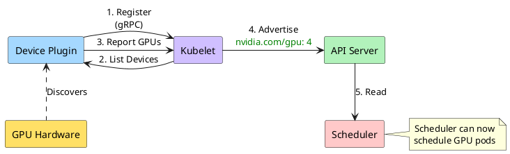

# Device Plugins Turn GPUs Into Schedulable Resources

**Four Core Functions:**

<v-clicks>

1. **Device Discovery** — Detect GPUs, report to Kubelet
2. **Resource Allocation** — Exclusive access by default
3. **Health Monitoring** — Report unhealthy devices
4. **Scheduler Integration** — Expose as `nvidia.com/gpu`

</v-clicks>

**The magic moment:** GPUs go from invisible to schedulable

<!--
Device Plugin framework extends Kubernetes beyond CPU and memory.

gRPC interface between kubelet and vendor plugin.

The flow:
1. Device plugin registers with kubelet via gRPC
2. Kubelet asks for device list
3. Plugin reports GPU inventory (IDs, health)
4. Kubelet advertises to API server as extended resource
5. Scheduler reads nvidia.com/gpu: 4 and can schedule pods

Clean abstraction - Kubernetes doesn't need GPU-specific code.

NVIDIA, AMD, Intel each provide their own device plugin.

This is the magic moment—GPUs go from invisible hardware to first-class schedulable resources.

Timing: 120 seconds
-->
