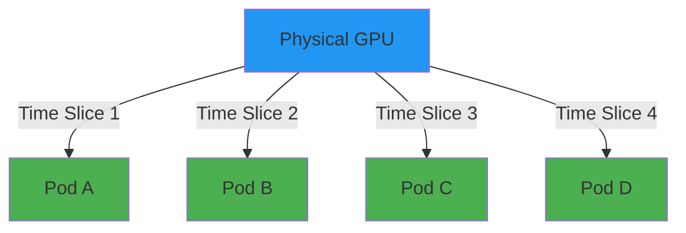

# Time-Slicing Oversubscribes GPUs

**Concept:**
- 1 physical GPU → N virtual GPUs
- Like CPU time-sharing
- Processes interleave on GPU
- No memory isolation

<div class="mt-4">

**Configuration:**

```yaml
sharing:
  timeslicing:
    renameByDefault: true
    resources:
    - name: nvidia.com/gpu
      replicas: 8
```

</div>

::right::

<div class="mt-8">



<div class="mt-4 text-sm">

Node shows: `nvidia.com/gpu: 8` (instead of 1)

</div>

</div>

<!--
Time-slicing is oversubscription.

1 physical GPU advertised as 8 schedulable resources. Kubernetes thinks 8 GPUs exist.

Pods time-share actual GPU - similar to CPU scheduler interleaving processes.

ConfigMap sets replica count. replicas: 8 means 1 physical becomes 8 virtual.

Can rename resource to nvidia.com/gpu.shared to distinguish from exclusive.

Key: Compute time-sharing, NOT memory isolation. All pods share same VRAM.

Timing: 120 seconds
-->
