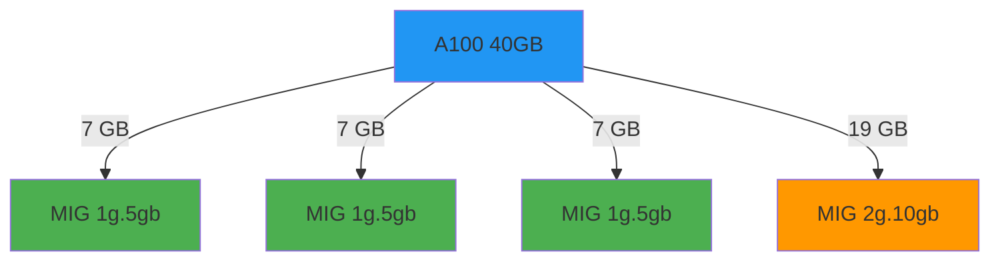

# MIG Provides Hardware-Isolated Partitions

**Hardware partitioning:**
- Supported: A100, A30, H100, B100/B200
- Fixed profiles (1g.5gb, 2g.10gb, 4g.20gb, ...)
- Memory isolation
- Fault isolation

**Strategies:**

```yaml
# Single: All GPUs identically partitioned
mig:
  strategy: single

# Mixed: Different partitions per GPU
mig:
  strategy: mixed
```

::right::

<div class="mt-8">



<div class="mt-4 text-sm">

Each MIG instance: dedicated memory & compute

</div>

</div>

<!--
Multi-Instance GPU (MIG) is true hardware partitioning - not time-sharing.

A100 can be split into up to 7 MIG instances. Each gets:
- Fixed memory (5GB, 10GB, 20GB, 40GB profiles)
- Dedicated compute cores
- Separate fault domain

One MIG instance crashes, others keep running.

Strategies:
- Single: All GPUs same MIG config (simple but inflexible)
- Mixed: Different partitions per GPU (flexible, complex)

MIG Manager in GPU Operator handles partition creation automatically.

Timing: 120 seconds
-->
