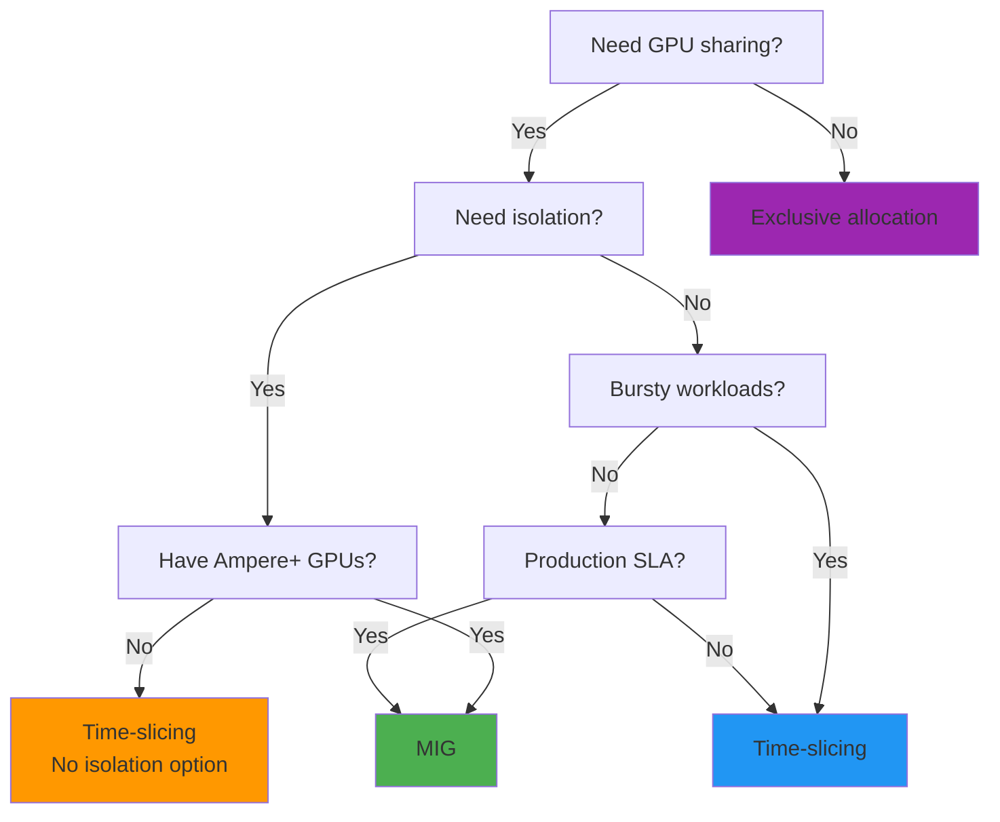

# GPU Sharing Decision Framework

<!--
Decision tree for GPU sharing:

Start: Do you need sharing at all, or is exclusive allocation sufficient?

If sharing:
- Need isolation (production, multi-tenant): MIG if available, otherwise time-slicing with caution
- Don't need isolation (dev, bursty): Time-slicing
- Production SLA requirements: MIG preferred

Most LLM inference: Exclusive allocation (models too large)
Many small models: Consider sharing

Timing: 90 seconds
-->
