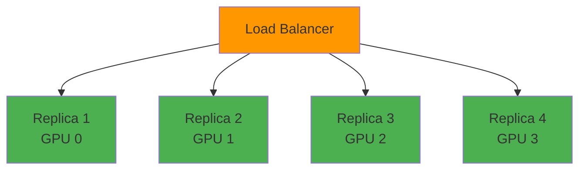

# Two Motives for Multi-GPU

## 1. Throughput Scaling

(Data Parallelism)

**Goal:** Serve more concurrent requests
**Method:** Multiple independent replicas
**Benefit:** Higher QPS

## 2. Model Parallelism

(Model too large for 1 GPU)

**Goal:** Fit model exceeding 1 GPU
**Method:** Split model across GPUs
**Benefit:** Serve larger models

<!--
Two completely different reasons to use multiple GPUs:

1. Throughput (left): Model fits on 1 GPU, want to handle more requests/sec. Solution: N copies on N GPUs, each handles different requests. Horizontal scaling.

2. Model Parallelism (right): Model too big for 1 GPU. Need multiple GPUs to hold one instance. Solution: Split model across GPUs, each processes part of each request. Vertical scaling.

Fundamentally different patterns with different trade-offs. Let's explore each.

Timing: 120 seconds
-->
