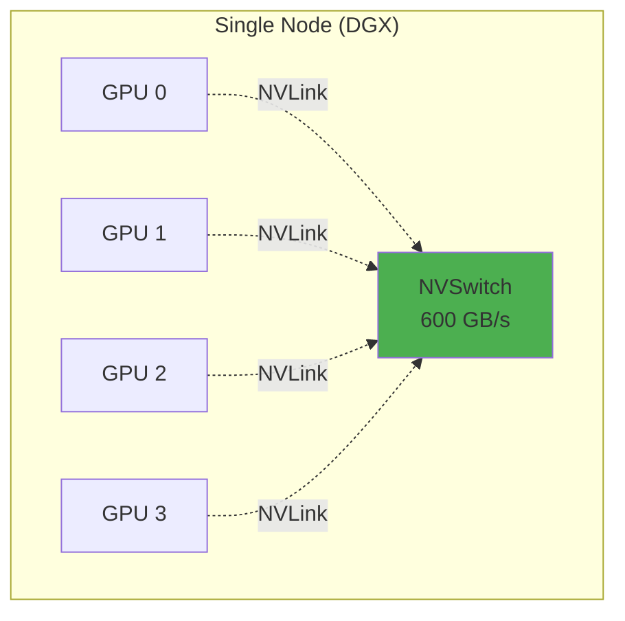

# Single-Node: Fast and Simple

**Characteristics:**
- All GPUs in same server
- NVLink/NVSwitch (~600 GB/s)
- Simple in Kubernetes

**Pod Request:**
```yaml
spec:
  containers:
  - name: llm
    resources:
      limits:
        nvidia.com/gpu: 8
```

All 8 GPUs via `CUDA_VISIBLE_DEVICES`

::right::

<div class="mt-8">



**All GPUs connected at full bandwidth**

</div>

<!--
Single-node multi-GPU: simplest and fastest.

High-end servers (DGX A100) have 8 GPUs via NVSwitch. ~600 GB/s all-to-all bandwidth.

In Kubernetes: Request nvidia.com/gpu: 8. Scheduler finds node with 8 free GPUs. Framework (vLLM, TGI) initializes tensor parallelism.

No special networking. Everything local.

Ideal for: Tensor parallelism, models fitting 1-8 GPUs (most up to ~70B params).

Limitation: Can't exceed GPU count of largest node. If need 16 GPUs and nodes have 8, must go multi-node.

Timing: 120 seconds
-->
