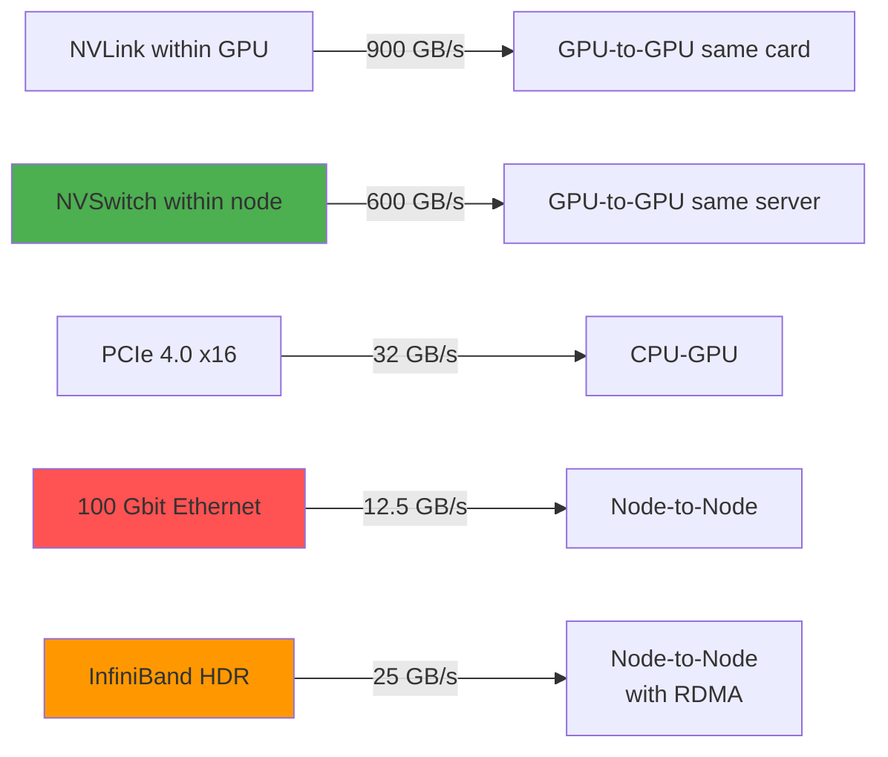

# Multi-Node Topology and Bandwidth Hierarchy

### Intra-GPU
**900 GB/s**
Memory bandwidth

### Intra-Node
**600 GB/s**
NVSwitch
→ Tensor parallelism

### Inter-Node
**12.5 GB/s** (Ethernet)
**25 GB/s** (InfiniBand)
→ Pipeline parallelism

<!--
Bandwidth hierarchy visualization:

Within GPU: 900 GB/s memory
Between GPUs same node (NVSwitch): 600 GB/s
Over PCIe: 32 GB/s
Between nodes (Ethernet): 12.5 GB/s
Between nodes (InfiniBand): 25 GB/s

Massive drop crossing network.

Why:
- Tensor parallelism stays within nodes
- Pipeline parallelism goes across nodes
- InfiniBand helps but can't match NVLink

Design guidance:
- Prefer single-node if possible
- Tensor within nodes, pipeline across
- Invest in InfiniBand if multi-node required

Timing: 90 seconds
-->
